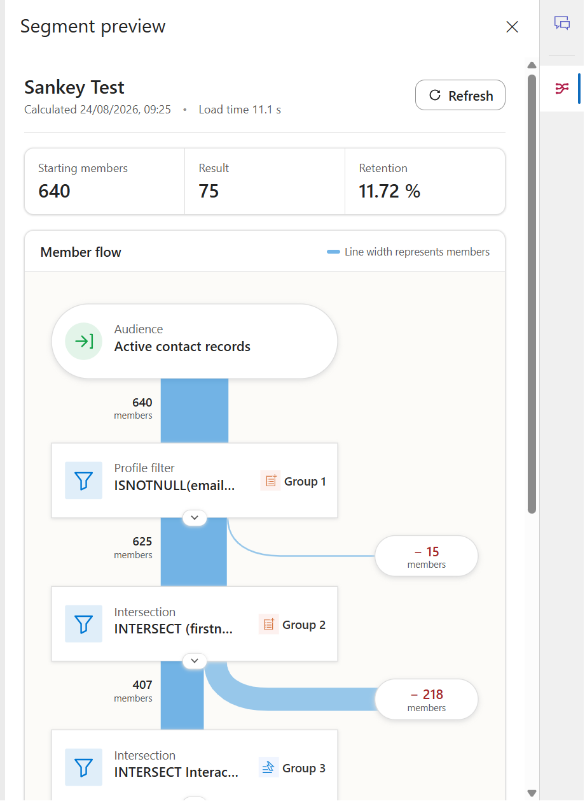
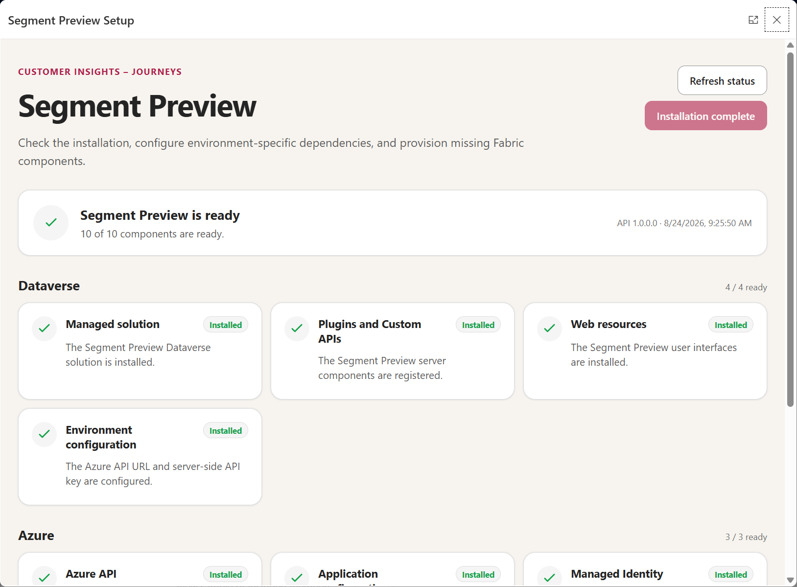

# Customer Insights Segment Sankey

Side-pane preview for draft segments in Dynamics 365 Customer Insights - Journeys.

## Product experience

### Draft segment preview

See cumulative member counts for every filter stage without leaving the
Customer Insights segment editor.



### Browser-only installation

The Setup Center provisions and verifies Dataverse, Azure, and Microsoft
Fabric directly from Dynamics 365.



## Downloads and installation

**Import the solution, open the setup page, press one button. Nothing is
installed on your computer.**

1. Import
   [`CustomerInsightsSegmentPreview_managed.zip`](deployment/dataverse/CustomerInsightsSegmentPreview_managed.zip)
   into an environment where Customer Insights - Journeys is installed.
2. Open **Settings > Overview > Segment Preview**.
3. First time only: expand **Connect this environment**. The page shows the exact
   redirect URI and permission list, opens the Microsoft Entra admin center for
   you, and writes the resulting client id back. About two minutes, all in the
   browser.
4. Press **Load subscriptions**, select an enabled subscription from your Azure
   tenant, and then select an existing Resource Group or choose
   **Create a new resource group**.
5. If a new Fabric workspace is needed, press **Load capacities** and select
   one of the active capacities available to your account.
6. Press **Preview** to see the plan and the consent checklist, then
   **Install everything** and sign in once when the pop-up appears.

### Update an existing installation

Do not uninstall the previous Managed Solution. Import the newer
`CustomerInsightsSegmentPreview-<version>-managed.zip` from the latest GitHub
release into the same Dataverse environment, then reopen **Settings > Overview >
Segment Preview** and press **Install everything** again.

Setup reuses the resource identities stored in `klth_SetupConfiguration` and
updates the existing deployment in place. It does not rebuild every Fabric
shortcut:

- an exact per-table Dataverse target match is skipped;
- a missing Serving Lakehouse shortcut is created;
- an existing shortcut with stale connection, Managed Lake folder, environment,
  or table metadata is repaired with `CreateOrOverwrite`.

The bootstrap step shows determinate progress for every required Dataverse
table and reports whether it was created, repaired, already current, or deferred.
A table that has not yet appeared in the Dataverse Link does not stop the
remaining tables or prevent the bootstrap notebook from being published. The
notebook checks again; if Microsoft synchronization is still incomplete, use
the Setup diagnostics, confirm the table under **Power Apps > Link data > Manage
tables**, and run **Install everything** again.

For a new installation, only **Azure subscription** and **Resource Group** are
required selections. Setup generates the remaining names and defaults,
discovers the matching Fabric connection, and creates or reuses the workspace
and lakehouse. An existing Fabric Capacity can optionally be selected under
**Advanced options**; otherwise setup chooses a suitable active capacity.
Setup grants the Web App managed identity access only to that capacity. When the
Segment Preview panel later finds it paused, it resumes the capacity automatically
and shows startup progress before querying Fabric.

The Setup Center deploys the Azure infrastructure and API, discovers or creates
the Fabric workspace, serving lakehouse, bootstrap notebook and workspace
permissions, generates the server-side API key, writes the Dataverse environment
variable values, and verifies the result. It is idempotent and resumable: close
the page and reopen it and completed steps are skipped. During an update, steps
that must refresh definitions are rerun safely while already-correct
per-table shortcuts are left untouched. Fabric workspace, capacity, and
Dataverse-connection permissions are revalidated idempotently on every run, so
an older completion record cannot hide a newly required role assignment.

The two steps that look as if they need a build machine do not. The bootstrap
notebook ships **inside the solution** as a Jupyter definition, so the browser
substitutes the resolved workspace and lakehouse ids and publishes it through the
Fabric item-definition API. The API is deployed as a verified package copy, and
the copy happens inside Azure rather than in the browser: the page hands the
pinned release URL and its SHA-256 to the Azure deployment, which downloads the
ZIP, checks the digest, and stores it as an immutable blob in a private storage
account in **your own resource group**. The Web App then reads that blob with its
own managed identity — no shared access signature, nothing that expires. Nothing
is built, downloaded or executed on your machine.

**Everything stays yours.** The Entra application, the Azure resource group, Web
App, storage account and Application Insights, the Fabric workspace and lakehouse,
and every Dataverse value are created in and owned by your own tenant and subscription.
The API package is copied into your own storage during installation, so the running
system depends on no service operated by anyone else. No data and no credential
leaves your tenant.

> **Why the environment has to be connected first.** The page provisions the
> Azure API the product later talks to, so it cannot use that API to bootstrap
> itself, and a Dataverse session grants no Azure or Fabric rights. Something must
> hold delegated Azure/Fabric permissions, and that needs an Entra application.
> So the first time you open the page you register one **in your own tenant** — a
> single-page public client with no secret, guided end to end from the page, which
> you can delete once setup is done.
>
> This repository ships **no** client id, service URL or secret and never invents
> one. An **optional** hosted-service (broker) mode also exists for organisations
> that would rather run one service than register one app per environment; its
> source and tests live in [`Broker/`](Broker/), no instance is hosted, and it is
> never required. Until the environment is connected the Setup Center honestly
> reports `manual` mode and renders the checklist. See
> [`documentation/setup-center-contract.md`](documentation/setup-center-contract.md).

A PowerShell orchestrator is also available for CI and scripted re-deployments.
It is **optional and never required**; run it locally or in
[Azure Cloud Shell](https://shell.azure.com):

```powershell
pwsh -File .\deployment\Install-SegmentPreview.ps1 `
  -DataverseEnvironmentUrl https://contoso.crm4.dynamics.com `
  -ResourceGroup rg-segment-preview `
  -WebAppName contoso-segment-preview `
  -FabricWorkspaceName "Customer Insights Serving"
```

Run it with `-ConsentReportOnly` first to see the execution plan and the few
tenant consents that remain interactive.

- [Installation guide, automation coverage, and consent matrix](deployment/README.md)
- [Setup Center contract](documentation/setup-center-contract.md)
- [Optional PowerShell orchestrator](deployment/Install-SegmentPreview.ps1)
- [Managed Dataverse Solution](deployment/dataverse/CustomerInsightsSegmentPreview_managed.zip)
- [Unmanaged Dataverse Solution](deployment/dataverse/CustomerInsightsSegmentPreview.zip) (developer upgrades; intentionally does not modify the Marketing app sitemap)
- [System Architecture (PDF)](documentation/CustomerInsightsSegmentSankey-SystemArchitecture.pdf)
- [System Architecture (Word)](documentation/CustomerInsightsSegmentSankey-SystemArchitecture.docx)
- [Editable architecture diagrams](documentation/diagrams/)

For every customer installation, the Managed Solution should be used. Its
Sitemap component contains only an additive `Segment Preview` SubArea patch, so
existing customer navigation entries remain intact. The unmanaged developer
package deliberately omits the Marketing app Sitemap because Dataverse does not
isolate competing unmanaged Sitemap customizations.
Every versioned GitHub release additionally contains a complete source package,
deployment templates, documentation, architecture files, checksums, and both
Dataverse solutions.

## Included web resources

| File | Dataverse name | Type |
|---|---|---|
| `webresources/cis_SegmentSankeyLauncher.js` | `klth_/SegmentSankey/launcher.js` | JavaScript |
| `webresources/segment-sankey.html` | `klth_/SegmentSankey/segment-sankey.html` | HTML |
| `webresources/segment-members.html` | `klth_/SegmentSankey/segment-members.html` | HTML |
| `webresources/segment-preview-setup.html` | `klth_/SegmentSankey/segment-preview-setup.html` | HTML |
| `webresources/segment-preview-provisioning.js` | `klth_/SegmentSankey/segment-preview-provisioning.js` | JavaScript |
| `webresources/segment-preview-azure-template.js` | `klth_/SegmentSankey/segment-preview-azure-template.js` | JavaScript |
| `webresources/segment-sankey-icon.svg` | `klth_/SegmentSankey/segment-sankey-icon.svg` | SVG |

The resource names use the `klth` publisher prefix of the target solution.
`segment-preview-azure-template.js` is generated from `deployment/azure/main.bicep`;
regenerate it with `deployment/azure/Update-AzureTemplateWebResource.ps1`.

## Installable solution

The transportable Managed Solution is located at
`deployment/dataverse/CustomerInsightsSegmentPreview_managed.zip`. It contains
plugins, custom APIs, environment variable definitions, web resources, the
segment command, and the new **Segment Preview** menu item under
**Settings > Overview** of the Customer Insights - Journeys app.

After import, the Setup Center provisions and checks the state of Dataverse,
Azure, and Fabric. Missing Dataverse shortcuts can be installed directly and
idempotently. The Azure infrastructure is provisioned reproducibly from
`deployment/azure/main.bicep`. `deployment/Install-SegmentPreview.ps1` automates
the same installation from a shell; the full process, the automation coverage
matrix, and the remaining interactive consents are described in
`deployment/README.md`.

## Command bar setup

1. Add all three files as web resources to an unmanaged solution and publish it.
2. Add a command bar command **Segment preview** to the main form of the
   Real-Time Journeys segment definition.
3. Select `klth_/SegmentSankey/launcher.js` as the JavaScript library.
4. Call the function `CISegmentSankey.open` with the parameter `PrimaryControl`.
5. Only show the command once the segment has already been saved.

The launcher creates an entry in the right-hand side pane bar via the supported
API `Xrm.App.sidePanes.createPane()` and passes the segment ID and segment name
to the HTML web resource. Before opening and before every refresh, it saves a
changed form definition so that the segment designer and the side pane evaluate
the same MQL. While the pane is open, the launcher monitors the active
model-driven app page. When switching to a different segment definition, it
navigates the existing pane to the new segment ID as soon as the new form
context has loaded. When leaving a segment detail page, it closes the pane
automatically. A manually closed pane is not reopened. Because model-driven
apps do not always perform a full reload when navigating again to the same web
resource, the HTML web resource additionally monitors the active segment ID.
After a stable record change, it resolves the segment name directly from
Dataverse and updates the count automatically.

## Architecture

The preview evaluates the complete segment in the shared Fabric serving lakehouse:

- The Dataverse plugin reads and validates the draft MQL, resolves
  relationships, segment references, and static member groups, and sends a
  typed AST to the secured ASP.NET Core API.
- Relationship parsing supports simple and recursively nested `RELATE` and
  `RELATEOPTIONAL` paths, including Customer Insights Data measure paths.
- Dataverse 1:N and N:N relationships are resolved from metadata; N:N filters
  join through the registered intersect table instead of comparing unrelated
  entity primary keys.
- Runtime dependency provisioning waits for newly added Dataverse shortcuts to
  appear in the SQL catalog before compiling the segment count query.
- Missing tables trigger the Fabric SQL metadata refresh API. A shortcut whose
  Dataverse Managed Lake target has no Delta table is reported with initial-sync
  and Fabric-link refresh guidance instead of being retried as catalog latency.
- Runtime shortcuts copy the exact Dataverse target metadata from the matching
  source-Lakehouse shortcut, including table-specific Managed Lake folder paths.
  Existing shortcuts with stale targets are repaired automatically.
- The dependency response confirms catalog readiness, so a Solution/API version
  mismatch fails with Setup Center upgrade guidance instead of stale-table errors.
- `/api/segment-counts` compiles profile, relationship, consent, and
  `Interaction(...)` filters, including `UNION`, `INTERSECT`, and `EXCEPT`,
  into parameterized Fabric SQL CTEs.
- Fabric executes all set operations and returns only `COUNT_BIG(*)` per
  stage. Profile IDs are never transmitted to the plugin or the browser.

Both sources are additionally provisioned into a shared serving lakehouse:

- `journeys.*` contains the exported Customer Insights - Journeys events.
- `dataverse.*` contains only the Dataverse tables required by active
  segments, as Direct/OneLake shortcuts.
- The MQL dependency resolver detects profile, relationship, and consent
  tables, including nested segment references.
- The secured Fabric API adds missing Dataverse shortcuts serially and
  append-only. Existing shortcuts are never replaced by a full mirror
  reconfiguration.
- The bootstrap notebook registers only the configured installation baseline
  tables. It does not copy every table from a large Dataverse link; additional
  segment dependencies are added on demand by the secured Fabric API.

The UI shows the calculation timestamp and the end-to-end load time. The
actual data state depends on the Customer Insights export to Fabric. The
published Customer Insights member count may differ from the live-computed
draft preview until the next segment evaluation.

### Member view

Clicking a stage card, the result, or an in-/out-flow bubble opens a large
Dynamics dialog with the associated contacts. Stage cards show the
cumulatively remaining members, red bubbles the members removed at that
transition, and green bubbles the members newly added.

The list is searched, filtered, and sorted exclusively server-side and loaded
with at most 50 contacts per page. Fabric computes the requested stage set and
returns only contact IDs. The Dataverse plugin then loads the visible contact
fields in the context of the signed-in user, so record- and field-level
security are preserved. Evaluation and paging use short-lived, encrypted
continuation tokens; neither millions of IDs nor contact fields are ever
transmitted to the browser or into a URL.

## Count provider

The UI expects an unbound Dataverse custom API:

- Unique name: `klth_GetSegmentFilterCounts`
- Request parameter: `klth_segmentid` (`Guid`, required)
- Response property: `klth_resultjson` (`String`)

Response format:

```json
{
  "generatedAt": "2026-08-17T09:00:00Z",
  "isEstimate": false,
  "stages": [
    {
      "label": "All contacts",
      "detail": "PROFILE(contact)",
      "count": 24840
    },
    {
      "label": "Email present",
      "detail": "Email contains data",
      "count": 19560
    }
  ]
}
```

`stages` must be ordered cumulatively: base, filter 1, filter 1+2, and so on.
The web resource computes losses and retention from this.
The visualization follows the Customer Insights journey canvas: Fluent cards
represent the base and filters, proportionally wide connections show the
remaining flow, and side `Excluded` cards show the amount removed per stage.

Customer Insights does not offer a supported endpoint that evaluates
arbitrary draft MQL queries per sub-filter. The provider therefore explicitly
translates the supported MQL into Dataverse queries and Fabric SQL.
Unsupported events, fields, or operators produce a clear error and never a
spurious count of null. The editor's internal preview endpoints are not used.

## Fabric Segment Engine

### Components

| Component | Purpose |
|---|---|
| `FabricApi/` | ASP.NET Core API with managed identity and a metadata-driven SQL compiler |
| `Fabric/` | Daily bootstrap for all Journeys delta event folders |
| `CustomApi/FabricSegmentCountClient.cs` | MQL AST construction and server-side call to `/api/segment-counts` |
| `CustomApi/FabricDependencyProvisioningClient.cs` | Calls `/api/fabric-dependencies` and ensures missing Dataverse shortcuts |

The bootstrap creates a OneLake shortcut under `Tables/journeys/<EventName>`
for every delta folder under `Files/Customer Insights Journeys/<EventName>`.
This makes new event types visible in the SQL endpoint without any code
change. `journeys._event_registry` logs successful and failed registrations.

The bootstrap also reads the selected tables from the Dataverse mirror and
creates idempotent shortcuts under `Tables/dataverse`. The
`dataverse._shortcut_registry` registry documents this reconciliation. At
runtime, the plugin calls `/api/fabric-dependencies`; this makes newly
required relationship or consent tables automatically available in the same
SQL endpoint as the Journeys events.

The API resolves tables and columns exclusively via `INFORMATION_SCHEMA`,
quotes all identifiers, and parameterizes values. Known Journeys aliases are:

- `msdynmkt_emaillinkclicked` → `RedirectLinkClicked`
- `msdynmkt_customlinkclicked` → `CustomLinkClicked`
- `msdynmkt_botemaillinkclicked` → `BotEmailLinkClicked`

The set operations `INTERSECT`, `UNION`, and `EXCEPT` are supported, as are
the conditions AND, OR, NOT, `==`, `!=`, `>`, `>=`, `<`, `<=`, `IN`,
`CONTAINS`, `Count()`, and `UTCMINUTES`, `UTCHOURS`, `UTCDAYS`, `UTCWEEKS`,
`UTCMONTHS`, and `UTCYEARS`.

For Dataverse text fields, `CONTAINS` follows Customer Insights semantics:
case is ignored, but diacritical characters remain distinct (`a` does not
match `á`).

### Dataverse configuration

The **Base Solution** (`KLTHBaseSolution`) contains the following environment variables:

- `klth_FabricBehavioralApiUrl`: HTTPS base endpoint of the Fabric API under `/api/`
- `klth_FabricBehavioralApiKey`: server-side API key

The names of these two environment variables originate from an earlier
architecture and are kept unchanged for compatibility reasons; today they
apply to all Fabric API calls (`/api/segment-counts` and
`/api/fabric-dependencies`), not only to behavioral-specific queries.

`klth_BusinessUnitScopingEnabled` records whether the irreversible Customer
Insights - Journeys **Business unit scoping** feature switch is enabled in the
environment. Microsoft exposes no supported API for reading that switch, so the
administrator sets it explicitly in the Setup Center. When enabled, every
returned count and member page is restricted to records whose
`owningbusinessunit` exactly matches the segment definition's owning business
unit; child business units are deliberately excluded.

The Setup Center adds five optional bootstrap variables that ship without default values:
`klth_SetupProvisioningMode`, `klth_SetupBrokerUrl`, `klth_SetupBrokerScope`,
`klth_SetupEntraClientId` and `klth_SetupConfiguration`. They configure the
bootstrap path and hold the resume record; secrets are stripped before the
configuration is written. See
[`documentation/setup-center-contract.md`](documentation/setup-center-contract.md).

The key must not be stored in JavaScript web resources or source code.
The web app authenticates to the Fabric SQL endpoint via managed identity.
For production operation, the App Service plan should use at least B1 with
**Always On** enabled. The current F1 plan does not support this option.
Otherwise the Linux process is terminated after being idle, and the first
call after that must additionally initialize the application, the managed
identity token, the Fabric SQL connection, and the catalog. Subsequent calls
use the warm process, connection pool, and catalog cache.
The API initializes the catalog in the background, keeps it for 60 minutes,
and sends a lightweight Fabric SQL keep-alive every four minutes. Catalog
refreshes use stale-while-refresh semantics so an existing preview is not
blocked by metadata refresh latency. These defaults can be adjusted with
`FABRIC_CATALOG_CACHE_MINUTES` and `FABRIC_WARMUP_INTERVAL_MINUTES`.
The initial load of the Fabric event catalog uses a 90-second timeout and
retries only a transient SQL execution timeout (`-2`) once after two seconds.
Business errors such as missing events or fields are not retried.

### Operating limits

- The full segment evaluation transmits only aggregated stage counts,
  regardless of profile count. This means there is no longer a 250,000-ID
  limit.
- Static segment references are currently passed to Fabric as a JSON
  parameter of their member IDs. For very large static segments, a persisted
  Fabric membership table is required; dynamic 30-million-profile segments
  are not affected by this.
- A count of `0` is returned only after a successful Fabric query.
- Missing event shortcuts or unmappable fields are reported explicitly.
- The daily bootstrap must run successfully for newly exported event types to
  become automatically available.

## Local preview

If `segment-sankey.html` is opened outside of Dynamics, it uses only local
sample data. Sample data is never used in Dataverse; there, the custom API is
always called.
